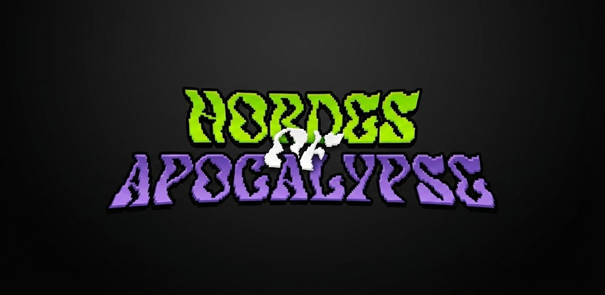

  
  

  <h1>🛡️ Tower Defense: Hordes of Apocalypse</h1>
  
  

    <strong>Proyecto Final - Paradigmas y Técnicas de Programación</strong>
     
    Grado en Ingeniería Matemática e Inteligencia Artificial
  

  

    
    
    
    
  

Este repositorio contiene el código fuente y los recursos de "Hordes of Apocalypse", un videojuego de estrategia Tower Defense desarrollado en Unity. El proyecto destaca por la implementación de una Inteligencia Artificial adversaria que funciona a través de heurísticas y aprende del comportamiento del jugador para ajustar la dificultad dinámicamente, tratando de dificultar al máximo al jugador para que este no consiga la victoria. 

## 📄 Descripción del Proyecto

El objetivo principal ha sido desarrollar un ciclo de juego completo (Preparación, Oleada, Victoria/Derrota) que cumpla con los estándares de un desarrollo profesional en Unity.

A diferencia de los Tower Defense tradicionales, donde las oleadas son estáticas, nuestro sistema integra un agente de **Machine Learning (ML-Agents)**. Este agente analiza las debilidades del jugador en tiempo real y genera composiciones de enemigos diseñadas específicamente para maximizar la probabilidad de derrota del usuario.

### Funcionalidades Principales
* **IA Adaptativa:** Generación de oleadas basada en el rendimiento del jugador.
* **Sistema de Torres:** 6 tipos de unidades con distintas estadísticas (daño, rango, velocidad) y mecánicas únicas.
* **Gestión Económica:** Sistema de compra, venta y mejora (upgrades) de torres en tiempo real.
* **Enemigos Variados:** Desde unidades básicas hasta tanques, corredores (rushers) y tres variantes de Jefes Finales (Bosses).
* **Interfaz Dinámica:** Indicadores visuales de rango, menús de gestión y HUD interactivo.

## 🔧 Arquitectura Técnica

El proyecto ha sido diseñado siguiendo una arquitectura modular dividida en capas (UI, Lógica, Datos, Entidades) y hace uso extensivo de patrones de diseño para garantizar la escalabilidad y mantenibilidad del código.

### Patrones de Diseño Implementados
1.  **Singleton:** Gestión centralizada de estados únicos (GameManager, SoundManager, EconomyManager).
2.  **Factory & Object Pooling:** Utilizado en el sistema de invocación (`EntitySummoner`) para reutilizar enemigos y optimizar la memoria, evitando la instanciación constante.
3.  **Strategy:** Permite a las torres cambiar su algoritmo de apuntado dinámicamente (atacar al primero, al último, al más fuerte o al más débil).
4.  **Observer:** Sistema de eventos desacoplado (`GameEvents`) para comunicar muertes de enemigos, cambios de dinero y estados de juego sin dependencias directas.
5.  **State:** Control del flujo principal del juego (Preparación, En Oleada, Victoria, Derrota) mediante estados explícitos.
6.  **Command:** Encapsulación de transacciones económicas para permitir un historial y validación segura de gastos.
7.  **Facade:** Simplificación de la lógica de mejora de torres (`TowerUpgradeUI`) unificando economía, estadísticas y visuales tras una sola interfaz.

## 🕹️ Mecánicas de Juego

* **Objetivo:** Evitar que los enemigos crucen el mapa y reduzcan la vida del jugador a cero.
* **Ciclo:** La partida consta de 15 oleadas. Entre oleadas, el jugador tiene un tiempo de preparación para gestionar sus defensas.
* **Torres Disponibles:**
    * *Knight Tower:* Equilibrada.
    * *Orc Tower:* Alto daño, corto alcance.
    * *Mage Tower:* Largo alcance (Francotirador).
    * *Chicken Tower:* Ataque muy rápido cuerpo a cuerpo.
    * *Alien Tower:* Visión y detección superior.
    * *Couple Tower:* Variante táctica equilibrada.
* **Configuración Táctica:** Al hacer clic en una torre colocada, se puede priorizar qué objetivo atacar y gestionar sus mejoras.

## 💻 Requisitos e Instalación

**Versión del Motor:** Unity 6000.2.6f2

### Pasos para ejecutar:
1.  Clonar este repositorio en tu equipo local.
2.  Añadir el proyecto a **Unity Hub**.
3.  Asegurarse de que los paquetes de **ML-Agents** estén correctamente instalados si se desea entrenar la IA (opcional para solo jugar).
4.  Abrir la escena `MainMenu` ubicada en la carpeta de escenas.
5.  Presionar **Play**.

## 👥 Autores

* **Andrés Gil Vicente**
* **Jorge Carnicero Príncipe**

*Fecha de finalización: 3 de enero de 2026*
